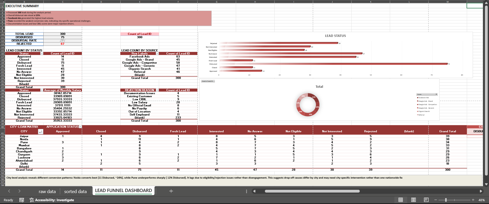

# Lead Funnel Performance Dashboard

## Project Overview

This dashboard was developed during the first week of my internship to monitor and analyze the lead conversion funnel for a lending business.

The objective was to identify bottlenecks in the customer acquisition process and derive actionable business insights using Microsoft Excel.

---

## Dashboard Preview

---

## Objectives

- Analyze lead conversion performance
- Monitor disbursal rates
- Identify major rejection reasons
- Compare city-wise performance
- Evaluate lead source effectiveness

---

## Tools Used

- Microsoft Excel
- Pivot Tables
- Pivot Charts
- Dashboard Design
- Business Analysis

---

## Key KPIs

- Total Leads
- Disbursed Leads
- Disbursal Rate
- Rejected Applications
- City-wise Performance
- Lead Source Distribution

---

## Key Business Insights

- Facebook Ads generated the highest lead volume.
- Documentation issues and low CIBIL scores were major rejection reasons.
- Conversion performance varied significantly across cities.
- Dashboard findings can support targeted operational improvements.

---

## Files

- 📊 Lead_Funnel_Performance_Dashboard.xlsx
- 🖼️ dashboard.png

---

## Skills Demonstrated

- Data Cleaning
- Dashboard Design
- KPI Reporting
- Data Visualization
- Business Analysis
- Excel
